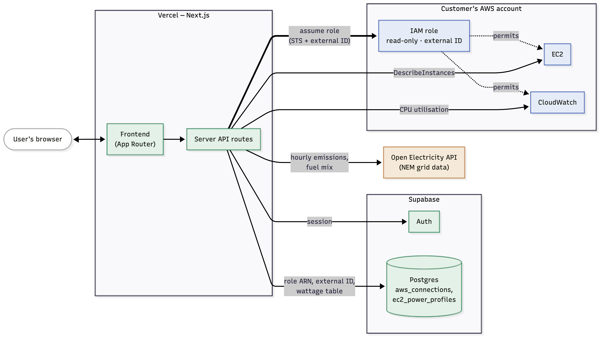

# LoadShift

LoadShift reads a fleet's real AWS compute and matches it against Australia's National Electricity Market (NEM) grid data, hour by hour, to show what that compute actually cost the atmosphere — and how much of it could be saved by running flexible work at a cleaner hour instead.

## Run locally

```bash
npm install
npm run dev
```

The app reads these variables from `.env`:

```text
NEXT_PUBLIC_SUPABASE_URL=...
NEXT_PUBLIC_SUPABASE_PUBLISHABLE_KEY=...
OPEN_ELECTRICITY_API_KEY=...
AWS_ACCESS_KEY_ID=...
AWS_SECRET_ACCESS_KEY=...
AWS_REGION=ap-southeast-2
AWS_CONTROL_REGION=ap-southeast-2
AWS_LOADSHIFT_ACCOUNT_ID=your-loadshift-aws-account-id
```

## Supabase setup

Run [`supabase/aws-schema.sql`](./supabase/aws-schema.sql) in the Supabase SQL Editor. It creates two tables, both behind Row Level Security:

- `aws_connections` - one row per user: a role ARN, an external ID, and a connection status. Never an access key.
- `ec2_power_profiles` - the Teads Engineering idle/max wattage per EC2 instance type, used to turn CPU utilisation into an electricity estimate.
Populate `ec2_power_profiles` from the full Teads dataset.

Email/password auth is handled by [`app/ui/auth-panel.js`](./app/ui/auth-panel.js). Supabase clients live in `lib/supabase`, and [`proxy.js`](./proxy.js) refreshes the cookie-based session on every request.

For email confirmation, add `http://localhost:3000/auth/callback` to Supabase Auth → URL Configuration → Redirect URLs, and add your Vercel URL there before deploying.

## How it works



**Connecting an account.** A customer never hands over AWS keys. They create a role in their own account (`LoadShiftReadOnly`) with a trust policy scoped to LoadShift's AWS account and a unique, per-connection external ID, and attach a permissions policy granting exactly `ec2:DescribeInstances`, `ec2:DescribeInstanceTypes`, `ec2:DescribeRegions`, `cloudwatch:GetMetricData`, and `cloudwatch:GetMetricStatistics`. LoadShift stores only the role ARN and the external ID (`app/api/aws/connection/route.js`). Every read assumes that role via STS for a short-lived, 15-minute credential - nothing in the granted policy can start, stop, modify, or terminate anything.

**Reading the fleet.** [`lib/fleet.js`](./lib/fleet.js) is the one place that builds the shared payload the rest of the app runs on: it lists running EC2 instances across the mapped regions, pulls hourly CloudWatch CPU utilisation for each, and turns CPU into watts using the Teads idle/max wattage table(. [`lib/grid-data.js`](./lib/grid-data.js) fetches the matching last-24-hours of emissions, energy, and fuel-mix data from Open Electricity for each region a customer's instances actually run in.

**Classifying workloads.** [`lib/classify.js`](./lib/classify.js) guesses whether each instance's work is time-sensitive or flexible, checked in order: an explicit `loadshift:flexible` tag, then a name/tag pattern (`prod`, `api`, `db` read as always-on; `batch`, `ci`, `etl`, `training` read as flexible), and failing both, the shape of its own CPU trace — long idle stretches with occasional bursts read as scheduled batch work, a steady load reads as a live service. Every verdict has the plain-language reason it was made.

**Scheduling the shift.** [`lib/optimiser.js`](./lib/optimiser.js) is a pure function that runs entirely in the browser, so every change to an instance's time-sensitivity slider recomputes instantly with no server round trip. For each instance marked flexible, only its *active* hours move (an hour drawing meaningfully above its idle floor) — idle draw is never counted as a saving, since an idling instance is a rightsizing problem, not a scheduling one. An active hour moves forward, in full, to the lowest-intensity hour reachable within that instance's allowed delay, wrapping past the end of the 24-hour window because the NEM's shape is a daily cycle.

**Visualising it.** [`app/ui/grid-hero-3d.js`](./app/ui/grid-hero-3d.js) renders that same payload as one scene: time on one axis, the NEM's live fuel mix on another, and the fleet's compute load as height. Toggling **Optimise** morphs the surface between the as-scheduled and shifted schedule.

**Trying it without an AWS account.** `/demo` and `/api/fleet?demo=1` ([`lib/demo-fleet.js`](./lib/demo-fleet.js)) run the identical pipeline above over a synthetic fleet, matched against real, live NEM data — so the whole product is explorable with zero setup.

## Known limits

- Regional grid mapping currently covers AWS Sydney (`ap-southeast-2` → NSW1) and Melbourne (`ap-southeast-4` → VIC1). Instances outside those regions are read but excluded from the totals until a mapping is added.
- This is a historical signal, not a forecast: LoadShift measures one real day and recommends a *time of day*, on the basis that the NEM's carbon curve is driven by sunrise/sunset and recurs day to day more than a single day's reading might suggest.
- Shifting is modelled at whole-hour resolution and assumes a moved job can run at its target hour.
- LoadShift recommends a window, it doesn't yet reschedule jobs for you. yet...
